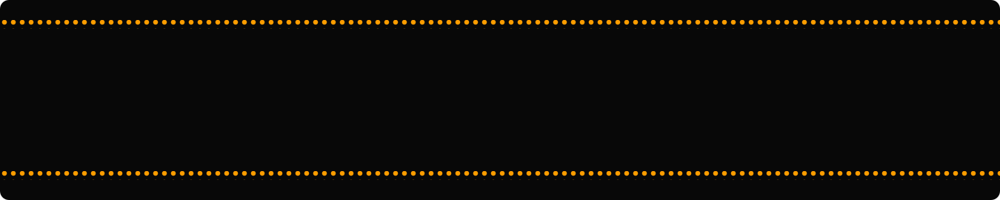

  

<pre><pre><strong>You have arrived!

Welcome aboard! 👋
I'm Audemars, your tour guide.
Let me show you around my journey through coding, projects, and the places I'm heading next.<strong></pre></pre>

## 🛂 Immigration
**Passport check and ready✅**
<table bgcolor="#dbeafe" align=center>
<tr>
</tr>
<tr>
<td colspan="4" align="center">
<strong>REPUBLIKA NG PILIPINAS | REPUBLIC OF THE PHILIPPINES
</strong>
</td>
</tr>

<tr>
<td rowspan="7" width="180" valign="top" align="center">
<small><strong>PASAPORTE/</strong> PASSPORT</small> 
 

</td>
<td valign="top">
<small>Uri/type</small> 
<strong>P</strong>
</td>
<td valign="top">
<small>Kodigo ng bansa/Country code</small> 
<strong>PHL</strong>
</td>
<td valign="top">
<small>Pasaporte blg/Passport no</small> 
<strong>AO16122023M</strong>
</td>
</tr>

<tr>
<td colspan="3" valign="top">
<small>Apelyido/Surname</small> 
<strong>ODATO</strong>
</td>
</tr>

<tr>
<td colspan="3" valign="top">
<small>Pangalan/Given names</small> 
<strong>AUDEMARS</strong>
</td>
</tr>

<tr>
<td colspan="3" valign="top">
<small>Panggitnang apelyido/Middle name</small> 
<strong>ORTERAS</strong>
</td>
</tr>

<tr>
<td colspan="3" valign="top">
<small>Petsa ng kapanganakan/Date of birth</small> 
<strong>09 APR 2005</strong>
</td>
</tr>

<tr>
<td valign="top">
<small>Kasarian/Sex</small> 
<strong>M</strong>
</td>
<td colspan="2" valign="top">
<small>Nasyonalidad/Nationality</small> 
<strong>FILIPINO</strong>
</td>
</tr>

<tr>
<td colspan="3" valign="top">
<small>Petsa ng pagsisimula/Started coding</small> 
<strong>18 JUN 2023</strong>
</td>
</tr>

<tr bgcolor="#eff6ff">
<td colspan="4" align="left">
 

P&lt;PHLODATO&lt;&lt;&lt;AUDEMARS&lt;&lt;&lt;&lt;&lt;&lt;&lt;&lt;&lt;&lt;&lt;&lt;&lt;&lt;&lt;&lt;&lt;&lt;&lt;&lt;&lt;&lt;&lt;&lt;&lt;&lt;&lt;&lt;&lt;&lt;&lt;&lt;&lt;&lt;&lt;&lt;&lt;&lt;&lt;&lt;&lt;&lt;&lt;&lt;&lt; 
AO16122023MPHL050409M18082023&lt;&lt;&lt;&lt;&lt;&lt;&lt;&lt;&lt;&lt;&lt;&lt;&lt;&lt;&lt;&lt;&lt;&lt;&lt;&lt;&lt;&lt;&lt;&lt;&lt;&lt;&lt;&lt;&lt;&lt;&lt;&lt;&lt;&lt;&lt;&lt;&lt;&lt;&lt;09

</td>
</tr>
</table>

## 🎒 Bag check✅
<!--  -->

<pre><strong><h3>📋 Travel essentials:</h3>
💻 Main compartment
&nbsp;&nbsp;&nbsp;&nbsp;✅ JavaScript 💛  
&nbsp;&nbsp;&nbsp;&nbsp;✅ React ⚛️  
&nbsp;&nbsp;&nbsp;&nbsp;✅ Node.js 🟢  
&nbsp;&nbsp;&nbsp;&nbsp;✅ Express.js 🚂

🧰 Tech pouch
&nbsp;&nbsp;&nbsp;&nbsp;✅ Git 🔀  
&nbsp;&nbsp;&nbsp;&nbsp;✅ GitHub 🐙  
&nbsp;&nbsp;&nbsp;&nbsp;✅ Vite ⚡  
&nbsp;&nbsp;&nbsp;&nbsp;✅ Postman 📮

📓 Carry-on
&nbsp;&nbsp;&nbsp;&nbsp;✅ Problem solving 🧠  
&nbsp;&nbsp;&nbsp;&nbsp;✅ Clean code 🧹  
&nbsp;&nbsp;&nbsp;&nbsp;✅ Continuous learning 📚
</strong>
</pre>

## 🎫 Boarding Passes
<pre align=center>
┌─────────────────────────────────────────────────────────────────────────────┐
│      🪽Ulalam pacific                                                       │
│    <small>Passenger name</small>        <small>Flight No.                  Seat</small>                   │
│     ODATO/AUDEMARS             5UL 142                <a href="https://ulalam-vanilla-js.netlify.app/">29F</a>                    │
│                              <small>09 JUN 2026</small>              <small>Boarding Group</small>         │
│     <strong>MNL ✈ HKG</strong>                <small><small>Be at boarding gate before</small></small>       <strong>4</strong>                     │
│                                0945H<small>(09:45am)</small>            <small>Gate</small>                  │
│                                                        <a href="https://github.com/audemarsodato/ulalam-vanilla-js">103</a>                   │
│     Status: ✈️In Flight                                                     │
└─────────────────────────────────────────────────────────────────────────────┘
</pre>
<pre align=left>
┌─────────────────────────────────────────────────────────────┐
│                                            BOARDING PASS    │
│--Air EisenPlan----------------------------------------------│
│  <small>Passenger name</small>                              <small>Flight No.</small>         │
│   ODATO/AUDEMARS                           EP1 93           │
│  <small>FROM</small>                                   <small>FLIGHT   TIME   SEAT</small>    │
│    Manila                             7May26  1615   <a href="https://eisenplan.netlify.app/">11B</a>    │
│  <small>TO</small>                                          GATE    ZONE   │
│    Macau                                     <a href="https://github.com/audemarsodato/eisenplan">103      1</a>     │
│                                                             │
│    Status: 🛬Landed                                         │
└─────────────────────────────────────────────────────────────┘
</pre>
<pre align=right>
┌─────────────────────────────────────────────────────────────────────────────┐
│   🛩️Social Graph airlines                                                   │
│    <small>Passenger name</small>                <small>Flight No.                  Seat</small>                   │
│     ODATO/AUDEMARS             4SG 861                <a href="">???</a>                    │
│                                <small>0? ??? ????</small>              <small>Boarding Group</small>           │
│     <strong>MNL ✈ ???</strong>                <small><small>Be at boarding gate before</small></small>       <strong>?</strong>                     │
│                                ????H<small>(0?:??am)</small>            <small>Gate</small>                  │
│                                                        <a href="https://github.com/audemarsodato/social-graph">103</a>                   │
│     Status: 🎟️Booked                                                        │
└─────────────────────────────────────────────────────────────────────────────┘
</pre>

<pre>
🗺️ <strong>ITINERARY</strong>

<strong>DAY 01 — JUN 2023</strong>
📍 <strong>MANILA</strong>

→ First coding session and first steps into programming

<strong>DAY 02 — DEC 2023</strong>
📍 <strong>MACAU</strong>

→ First major journey and laptop acquired

<strong>DAY 03 — 2024</strong>
📍 <strong>WEB DEVELOPMENT</strong>

→ Built my foundation in web development

<strong>DAY 04 — MAY 2026</strong>
📍 <strong>HONG KONG</strong>

→ Second major journey and built my first major
  full-stack project, EisenPlan

<strong>DAY 05 — JUN 2026</strong>
📍 <strong>ULALAM</strong>

→ Building a MERN-based social cooking application

<strong>DAY 06 — NEXT STOP</strong>
📍 <strong>SOFTWARE DEVELOPMENT</strong>

→ Looking for opportunities to grow as a software developer

<strong>DAY 07 — FUTURE</strong>
📍 <strong>FULL-STACK DEVELOPMENT</strong>

→ Building products, deepening my skills,
  and continuing the journey

</pre>

<pre>
<pre>
┌─────────────────────────────────────────────────────────────┐
│                                                             │
│  📮 POSTCARD                                               │
│                                                             │
│  GREETINGS FROM THE JOURNEY                                 │
│                                                             │
│  Thanks for stopping by my GitHub!                          │
│  If you'd like to connect or see more of my work:           │
│                                                             │
│  💼 <a href="https://www.linkedin.com/in/audemars-odato-a8b1a32b5/">LinkedIn</a>          🌐 <a href="https://audemars-odato.netlify.app/">Portfolio</a>          ✉️ <a href="mailto:audemarsodato@gmail.com">Email</a>      │
│                                                             │
│                                      ┌───────────────────┐  │
│                                      │       STAMP       │  │
│                                      │        🇵🇭         │  │
│                                      └───────────────────┘  │
│                                                             │
│  — AUDEMARS ODATO                                           │
└─────────────────────────────────────────────────────────────┘
</pre></pre>
